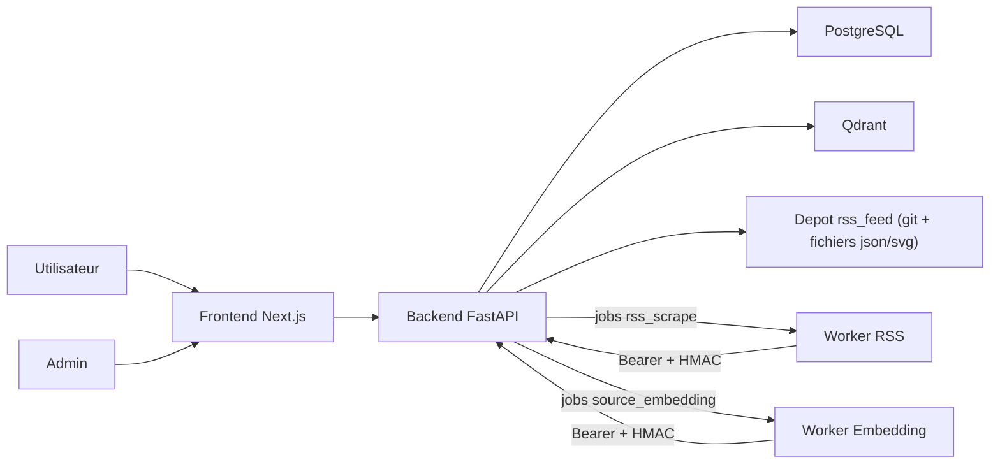
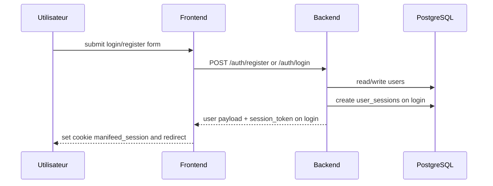
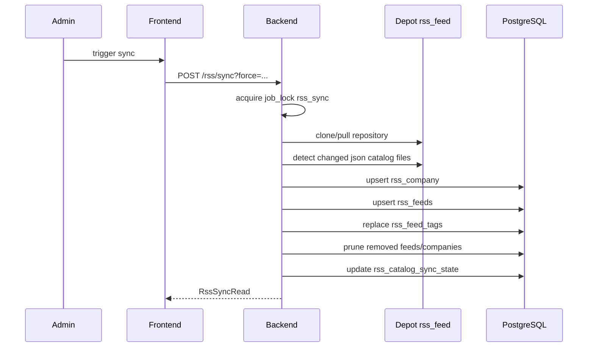
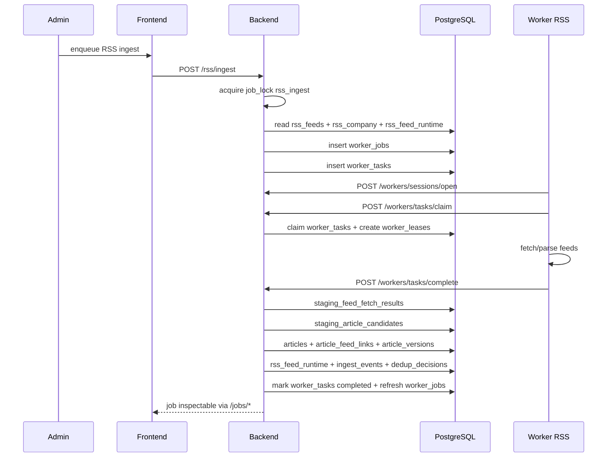
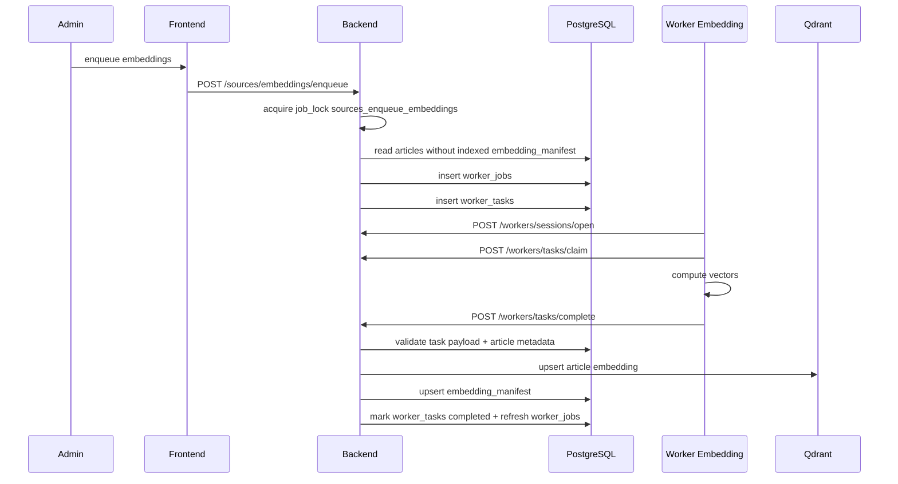
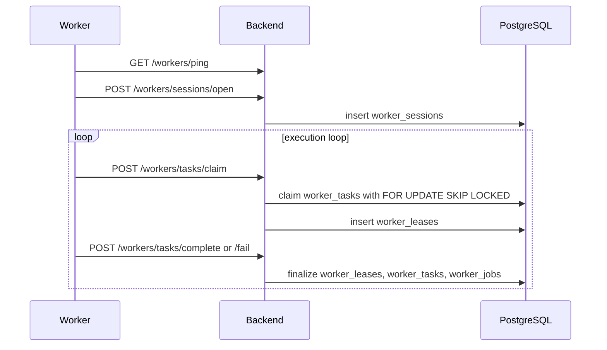

# Backend Manifeed

## Statut de cette documentation

Cette documentation est reconstruite a partir du code courant de `../backend`,
`../workers`, `../frontend` et du schema porte par `../infra`.

Elle decrit le backend apres la consolidation du gateway worker, du stockage
canonique des articles dans `articles` et de l'indexation des embeddings via Qdrant.

Le contrat HTTP publie est exporte dans `../api/openapi.json`.

## Role du backend

Le backend FastAPI est le point d'entree unique de Manifeed pour :

- le frontend web utilisateur et administration ;
- l'authentification web par session ;
- l'administration des comptes et des API keys workers ;
- la synchronisation du catalogue RSS ;
- la creation et le suivi des jobs RSS et embeddings ;
- le gateway HTTP des workers externes ;
- la finalisation des resultats workers vers PostgreSQL et Qdrant.

Le backend ne scrape pas directement les feeds et ne calcule pas lui-meme les
embeddings. Ces traitements sont executes par les workers Rust ; le backend
reste responsable du protocole, de la persistance et de la finalisation des jobs.

## Composants et dependances

| Composant | Role | Interfaces principales |
| --- | --- | --- |
| `FastAPI` | surface HTTP, auth, orchestration | `/auth/*`, `/account/*`, `/admin/*`, `/rss/*`, `/sources/*`, `/jobs/*`, `/workers/*` |
| `PostgreSQL` | source de verite applicative | users, sessions, catalogue RSS, jobs, tasks, articles, embeddings |
| `Qdrant` | index vectoriel des embeddings | upserts articles embeddes |
| depot `rss_feed` local | catalogue RSS versionne | clone/pull git, lecture `json/*.json`, resolution icones |
| frontend Next.js | console web utilisateur/admin | appelle le backend via proxies `/api/account/*` et `/api/admin/*` |
| workers Rust | scrape RSS et embeddings | Bearer API key + protocoles `/workers/*` |

## Carte d'ensemble

## Surface HTTP actuelle

### Web public

- `POST /auth/register`
- `POST /auth/login`

### Web authentifie utilisateur

- `POST /auth/logout`
- `GET /auth/session`
- `GET/PATCH /account/me`
- `PATCH /account/password`
- `GET/POST /account/api-keys`
- `DELETE /account/api-keys/{api_key_id}`

### Web authentifie admin

- `GET/PATCH /admin/users`
- `GET /health/`
- `GET /rss/`
- `PATCH /rss/feeds/{feed_id}/enabled`
- `PATCH /rss/companies/{company_id}/enabled`
- `POST /rss/sync`
- `GET /rss/img/{icon_url}`
- `POST /rss/ingest`
- `GET /sources/*`
- `POST /sources/embeddings/enqueue`
- `GET /jobs*`

### Gateway worker

- `POST /workers/sessions/open`
- `POST /workers/tasks/claim`
- `POST /workers/tasks/complete`
- `POST /workers/tasks/fail`
- `GET /workers/ping`
- `GET /workers/releases/manifest`

## Modele de securite

| Mecanisme | Ou | Detail |
| --- | --- | --- |
| mot de passe hash Argon2 | `users.password_hash` | utilise a l'inscription et a la connexion |
| session web hash SHA-256 | `user_sessions.token_hash` | token brut retourne par `/auth/login`, jamais relu en clair depuis la DB |
| transport session web | header ou cookie | `x-manifeed-session` ou `manifeed_session` |
| role applicatif | `users.role` | `admin` requis sur toutes les routes admin/ops |
| activation compte | `users.is_active` | bloque l'acces web et worker si faux |
| activation acces API worker | `users.api_access_enabled` | prerequis a la creation/usage des API keys workers |
| API key worker hash SHA-256 | `user_api_keys.key_hash` | la cle brute n'est retournee qu'a la creation |
| nommage worker stable | `pseudo + worker_type + worker_number` | derive en lecture, ex. `alice-rss-2` |
| signature HMAC worker | body JSON canonique | utilisee sur `complete` et `fail` |
| verrous d'operation | `job_lock` local + advisory locks PG | empeche les doubles sync, ingest, enqueue embedding et toggles simultanes |
| CORS | middleware FastAPI | `CORS_ORIGINS`, `allow_credentials=True` |

### Notes importantes

- Le backend ne pose pas lui-meme le cookie web au login : il retourne `session_token`,
  puis le frontend Next.js ecrit le cookie `manifeed_session`.
- `require_authenticated_user` met a jour `user_sessions.last_seen_at` a chaque appel
  protege, mais ne prolonge pas `expires_at`.
- `/workers/releases/manifest` est actuellement public.
- `/workers/ping`, `/workers/sessions/open` et `/workers/tasks/*` exigent une API key
  worker Bearer valide.
- `complete` et `fail` exigent en plus une signature HMAC calculee a partir du hash
  de l'API key worker.

## Flux critiques

### 1. Auth web

### 2. Synchronisation du catalogue RSS

### 3. Ingestion RSS de bout en bout

### 4. Embeddings de bout en bout

### 5. Gateway worker

## Tables et systemes les plus touches

| Domaine | Tables / systemes principaux |
| --- | --- |
| auth web | `users`, `user_sessions` |
| compte utilisateur | `users`, `user_api_keys` |
| admin | `users` |
| catalogue RSS | `rss_company`, `rss_feeds`, `rss_tags`, `rss_feed_tags`, `rss_catalog_sync_state`, depot `rss_feed` |
| jobs RSS | `worker_jobs`, `worker_tasks`, `rss_feed_runtime` |
| ingestion RSS complete | `staging_feed_fetch_results`, `staging_article_candidates`, `articles`, `article_feed_links`, `article_versions`, `ingest_events`, `dedup_decisions`, `rss_feed_runtime` |
| lecture sources | `articles`, `article_feed_links`, `rss_feeds`, `rss_company` |
| jobs embeddings | `worker_jobs`, `worker_tasks`, `embedding_manifest`, Qdrant |
| gateway worker | `worker_sessions`, `worker_leases`, `worker_tasks`, `worker_jobs` |

## References utiles

- `routes/README.md` : index de la reference route par route
- `routes_review.md` : page d'aiguillage vers la reference detaillee
- `routes_to_consumers.md` : matrice route -> consommateurs du code versionne
- `workers_rust.md` : comportements et contraintes cote workers
- `../api/openapi.json` : snapshot OpenAPI publie
