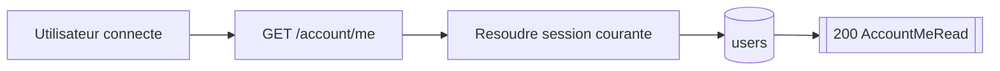
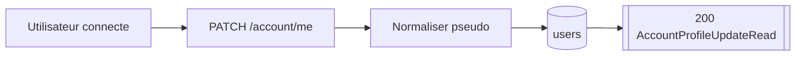
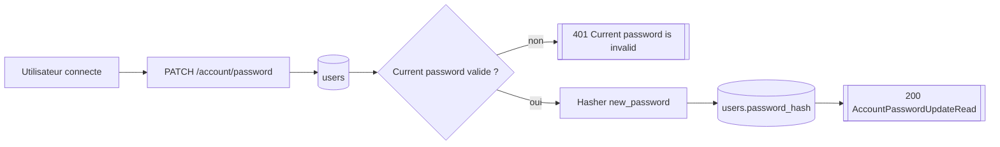
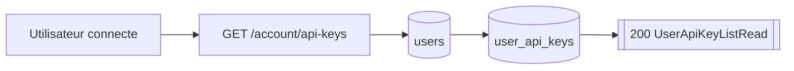
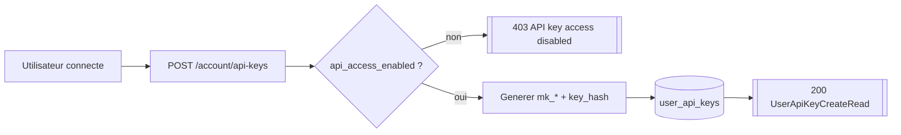
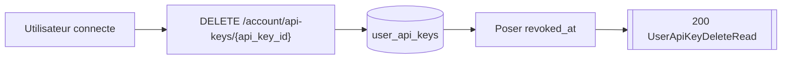

# Routes Account

## GET /account/me

- Consommateurs : `frontend/src/features/user/components/UserProfilePanel.tsx`.
- Securite : `Session user`.
- Inputs : pas de query ni body.
- Output :
  - `200` `AccountMeRead { user }`.
- Erreurs :
  - `404` user inexistant.
- Tables / systemes :
  - lecture `users`.
- Processus :
  1. resolve le user via la session ;
  2. relit `users` par id ;
  3. retourne le profil authentifie.

## PATCH /account/me

- Consommateurs : `frontend/src/features/user/components/UserProfilePanel.tsx`.
- Securite : `Session user`.
- Inputs :
  - Body `AccountProfileUpdateRequestSchema { pseudo }`.
- Output :
  - `200` `AccountProfileUpdateRead { user }`.
- Erreurs :
  - `404` user inexistant.
  - `409` pseudo deja pris.
  - `422` pseudo invalide.
- Tables / systemes :
  - lecture `users` ;
  - mise a jour `users`.
- Processus :
  1. relit le compte courant ;
  2. normalise le pseudo ;
  3. applique `update_user_admin_fields` avec seulement `pseudo` ;
  4. commit et retourne le user mis a jour.

## PATCH /account/password

- Consommateurs : aucun consumer versionne trouve dans `../frontend`.
- Securite : `Session user`.
- Inputs :
  - Body `AccountPasswordUpdateRequestSchema { current_password, new_password }`.
- Output :
  - `200` `AccountPasswordUpdateRead { ok: true }`.
- Erreurs :
  - `401` current password invalide.
  - `404` user inexistant.
  - `422` validation Pydantic.
- Tables / systemes :
  - lecture `users` ;
  - mise a jour `users.password_hash`.
- Processus :
  1. charge le user courant ;
  2. verifie `current_password` avec Argon2 ;
  3. hash `new_password` ;
  4. met a jour `users.password_hash` ;
  5. commit.

## GET /account/api-keys

- Consommateurs : `frontend/src/features/user/components/UserApiKeysPanel.tsx`.
- Securite : `Session user`.
- Inputs : pas de body.
- Output :
  - `200` `UserApiKeyListRead { items[] }`.
- Erreurs :
  - `404` user inconnu.
- Tables / systemes :
  - lecture `users` ;
  - lecture `user_api_keys`.
- Processus :
  1. relit le user ;
  2. liste uniquement les `user_api_keys` actives du compte (`revoked_at IS NULL`) ;
  3. derive `worker_name` a partir du pseudo et de `worker_number`.

## POST /account/api-keys

- Consommateurs : `frontend/src/features/user/components/UserApiKeysPanel.tsx`.
- Securite : `Session user`.
- Inputs :
  - Body `UserApiKeyCreateRequestSchema { label, worker_type }`.
- Output :
  - `200` `UserApiKeyCreateRead { api_key, api_key_info }`.
- Erreurs :
  - `403` si `api_access_enabled=false`.
  - `404` user inconnu.
  - `409` si le backend n'arrive pas a reserver un `worker_number` stable.
- Tables / systemes :
  - lecture `users` ;
  - insertion `user_api_keys`.
- Processus :
  1. refuse les comptes sans acces API worker ;
  2. genere une cle brute `mk_*` ;
  3. calcule `key_prefix` visible et `key_hash` SHA-256 ;
  4. insert la cle avec `worker_number = max(existing)+1` par type ;
  5. commit ;
  6. retourne la cle brute une seule fois.

## DELETE /account/api-keys/{api_key_id}

- Consommateurs : `frontend/src/features/user/components/UserApiKeysPanel.tsx`.
- Securite : `Session user`.
- Inputs :
  - Path `api_key_id >= 1`.
- Output :
  - `200` `UserApiKeyDeleteRead { ok: true }`.
- Erreurs :
  - `404` API key inconnue ou deja revoquee pour ce user.
- Tables / systemes :
  - mise a jour `user_api_keys.revoked_at`.
- Processus :
  1. verifie que la cle appartient au user courant ;
  2. marque `revoked_at=now()` ;
  3. commit.
