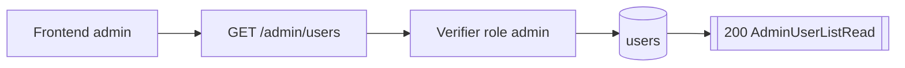
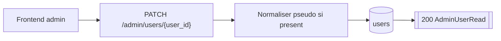

# Routes Admin

## GET /admin/users

- Consommateurs : `frontend/src/features/user/components/AdminUsersPanel.tsx`.
- Securite : `Session admin`.
- Inputs : pas de body.
- Output :
  - `200` `AdminUserListRead { items[] }`.
- Tables / systemes :
  - lecture `users`.
- Processus :
  1. verifie la session admin ;
  2. liste tous les users tries par creation ;
  3. retourne la vue admin complete.

## PATCH /admin/users/{user_id}

- Consommateurs : `frontend/src/features/user/components/AdminUsersPanel.tsx`.
- Securite : `Session admin`.
- Inputs :
  - Path `user_id >= 1`.
  - Body `AdminUserUpdateRequestSchema { pseudo?, role?, is_active?, api_access_enabled? }`.
- Output :
  - `200` `AdminUserRead`.
- Erreurs :
  - `404` user inconnu.
  - `409` pseudo deja pris.
  - `422` pseudo invalide.
- Tables / systemes :
  - lecture `users` ;
  - mise a jour `users`.
- Processus :
  1. charge le user cible ;
  2. normalise `pseudo` si present ;
  3. applique les champs admin autorises ;
  4. commit et retourne le user final.
