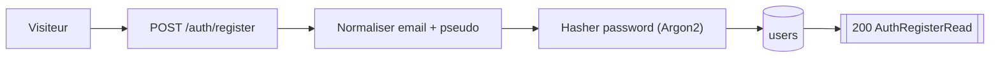
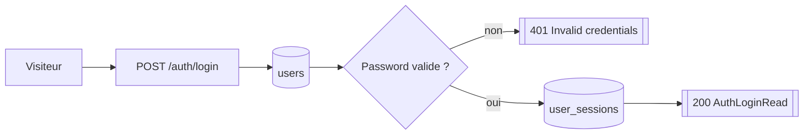
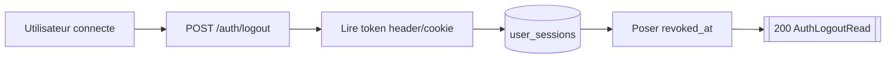
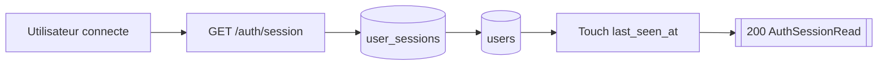

# Routes Auth

## POST /auth/register

- Consommateurs : `frontend/src/lib/server/auth-actions.ts`.
- Securite : `Public`.
- Inputs :
  - Body `AuthRegisterRequestSchema` : `email`, `pseudo`, `password`.
- Output :
  - `200` `AuthRegisterRead` avec `user`.
- Erreurs :
  - `409` si email deja pris ou collision email/pseudo.
  - `422` si pseudo invalide ou validation Pydantic.
- Tables / systemes :
  - lecture `users` par email ;
  - ecriture `users`.
- Processus :
  1. normalise l'email en lowercase ;
  2. slugifie le pseudo avec `normalize_user_pseudo` ;
  3. verifie l'unicite de l'email ;
  4. hash le mot de passe avec Argon2 ;
  5. cree `users.role="user"`, `is_active=true`, `api_access_enabled=false` ;
  6. commit puis retourne le user.

## POST /auth/login

- Consommateurs : `frontend/src/lib/server/auth-actions.ts`.
- Securite : `Public`.
- Inputs :
  - Body `AuthLoginRequestSchema` : `email`, `password`.
- Output :
  - `200` `AuthLoginRead` avec `session_token`, `expires_at`, `user`.
- Erreurs :
  - `401` credentials invalides.
  - `403` compte inactif.
- Tables / systemes :
  - lecture `users` ;
  - ecriture `user_sessions`.
- Processus :
  1. normalise l'email ;
  2. lit `users` ;
  3. verifie le mot de passe Argon2 ;
  4. genere un token `msess_*` ;
  5. stocke uniquement le hash SHA-256 dans `user_sessions.token_hash` ;
  6. retourne le token brut au frontend, qui pose ensuite le cookie.

## POST /auth/logout

- Consommateurs : `frontend/src/lib/server/auth-actions.ts`.
- Securite : `Session user`.
- Inputs :
  - Header facultatif `x-manifeed-session` ;
  - ou cookie `manifeed_session` ;
  - pas de body.
- Output :
  - `200` `AuthLogoutRead { ok: true }`.
- Erreurs :
  - `401` token manquant.
- Tables / systemes :
  - mise a jour `user_sessions.revoked_at`.
- Processus :
  1. recupere le token depuis le header ou le cookie ;
  2. hash le token ;
  3. marque la session comme revoquee ;
  4. commit et retourne `ok=true`.
- Note :
  - le backend ne supprime pas le cookie HTTP ; le frontend le fait juste apres.

## GET /auth/session

- Consommateurs : `frontend/src/app/api/auth/session/route.ts`, `frontend/src/lib/server/backend.ts`.
- Securite : `Session user`.
- Inputs :
  - Header `x-manifeed-session` ou cookie `manifeed_session`.
- Output :
  - `200` `AuthSessionRead { expires_at, user }`.
- Erreurs :
  - `401` token manquant, invalide ou expire.
  - `403` compte inactif.
  - `404` user inconnu apres resolution de session.
- Tables / systemes :
  - lecture `user_sessions` join `users` ;
  - mise a jour `user_sessions.last_seen_at` ;
  - revoque la session si `expires_at` depasse.
- Processus :
  1. charge la session par `token_hash` ;
  2. refuse les sessions revoquees ou expirees ;
  3. touche `last_seen_at` ;
  4. relit le user courant et retourne `expires_at` + profil.
