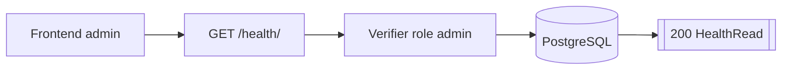

# Routes Health

## GET /health/

- Consommateurs : `frontend/src/services/api/health.service.ts`.
- Securite : `Session admin`.
- Inputs : aucun.
- Output :
  - `200` `HealthRead { status, database }`.
- Tables / systemes :
  - verification de connexion PostgreSQL.
- Processus :
  1. verifie la session admin ;
  2. appelle `check_db_connection(db)` ;
  3. retourne `ok/ok` ou `degraded/unavailable`.
- Note :
  - cette route n'est pas publique ; elle est reservee a l'admin.
