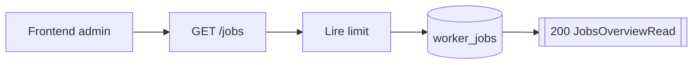
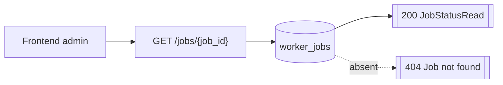
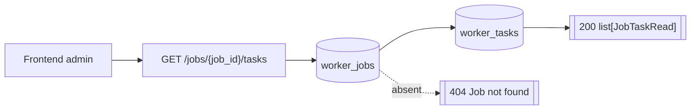

# Routes Jobs

## GET /jobs

- Consommateurs : `frontend/src/services/api/jobs.service.ts`.
- Securite : `Session admin`.
- Inputs :
  - Query `limit: 1..500 = 100`.
- Output :
  - `200` `JobsOverviewRead`.
- Tables / systemes :
  - lecture `worker_jobs`.
- Processus :
  1. lit les jobs tries par `requested_at desc` ;
  2. retourne `generated_at` + `items`.

## GET /jobs/{job_id}

- Consommateurs : `frontend/src/services/api/jobs.service.ts`.
- Securite : `Session admin`.
- Inputs :
  - Path `job_id`.
- Output :
  - `200` `JobStatusRead`.
- Erreurs :
  - `404` job introuvable.
- Tables / systemes :
  - lecture `worker_jobs`.
  - aucun effet de bord.

## GET /jobs/{job_id}/tasks

- Consommateurs : `frontend/src/services/api/jobs.service.ts`.
- Securite : `Session admin`.
- Inputs :
  - Path `job_id`.
  - Query `limit: 1..500 = 100`.
  - Query `offset >= 0 = 0`.
- Output :
  - `200` `list[JobTaskRead]`.
- Erreurs :
  - `404` job introuvable.
- Tables / systemes :
  - lecture `worker_jobs` ;
  - lecture `worker_tasks`.
- Processus :
  1. verifie l'existence du job ;
  2. lit les tasks du job dans l'ordre `task_id asc`.
