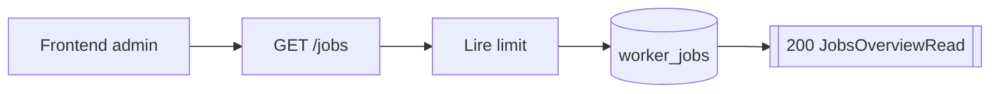
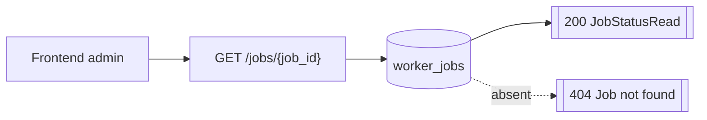
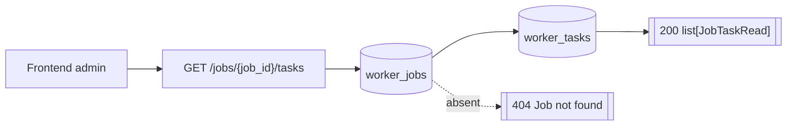
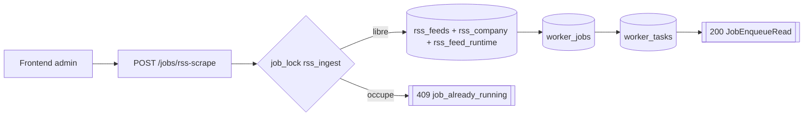
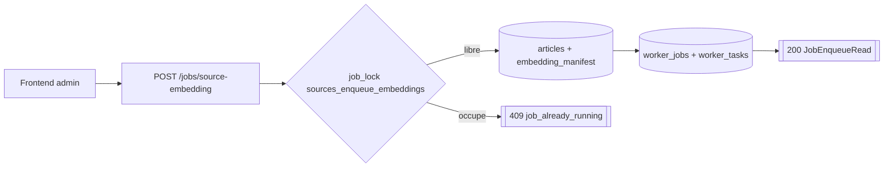

# Routes Jobs

Toutes les erreurs HTTP exposees par ces routes utilisent le contrat
`{ "code": string, "message": string, "details"?: unknown }`.

## GET /jobs

- Consommateurs : `frontend/src/services/api/jobs.service.ts`.
- Securite : `Session admin`.
- Inputs :
  - Query `limit: 1..500 = 100`.
- Output :
  - `200` `JobsOverviewRead`.
- Tables / systemes :
  - lecture `worker_jobs`.
- Processus :
  1. lit les jobs tries par `requested_at desc` ;
  2. retourne `generated_at` + `items`.

## GET /jobs/{job_id}

- Consommateurs : `frontend/src/services/api/jobs.service.ts`.
- Securite : `Session admin`.
- Inputs :
  - Path `job_id`.
- Output :
  - `200` `JobStatusRead`.
- Erreurs :
  - `404` job introuvable.
- Tables / systemes :
  - lecture `worker_jobs`.
  - aucun effet de bord.

## GET /jobs/{job_id}/tasks

- Consommateurs : `frontend/src/services/api/jobs.service.ts`.
- Securite : `Session admin`.
- Inputs :
  - Path `job_id`.
  - Query `limit: 1..500 = 100`.
  - Query `offset >= 0 = 0`.
- Output :
  - `200` `list[JobTaskRead]`.
- Erreurs :
  - `404` job introuvable.
- Tables / systemes :
  - lecture `worker_jobs` ;
  - lecture `worker_tasks`.
- Processus :
  1. verifie l'existence du job ;
  2. lit les tasks du job dans l'ordre `task_id asc`.

## POST /jobs/rss-scrape

- Consommateurs : `frontend/src/services/api/jobs.service.ts`, `frontend/src/app/rss/RssAdminPageClient.tsx`, `frontend/src/app/sources/SourcesAdminPageClient.tsx`.
- Securite : `Session admin`.
- Inputs :
  - Body optionnel `RssScrapeJobCreateRequestSchema { feed_ids?: PositiveInt[] }`.
- Output :
  - `200` `JobEnqueueRead`.
- Erreurs :
  - `409` si un job RSS actif existe deja.
  - `409` si l'operation d'enqueue elle-meme est deja en cours.
  - `502` si creation job/tasks impossible.
  - `422` validation body.
- Tables / systemes :
  - lecture `rss_feeds`, `rss_company`, `rss_feed_runtime` ;
  - ecriture `worker_jobs`, `worker_tasks`.
- Processus :
  1. prend `job_lock("rss_ingest")` ;
  2. verifie qu'aucun job `rss_scrape` `queued|processing` n'existe ;
  3. charge les feeds demandes ou tous les feeds `enabled` ;
  4. construit des batches de 20 feeds ;
  5. cree un `worker_jobs` `rss_scrape` ;
  6. cree un `worker_tasks` par batch ;
  7. commit ;
  8. si aucun feed n'est eligible, cree un job `completed` sans task.

## POST /jobs/source-embedding

- Consommateurs : `frontend/src/services/api/jobs.service.ts`, `frontend/src/app/sources/SourcesAdminPageClient.tsx`.
- Securite : `Session admin`.
- Inputs :
  - Body optionnel `SourceEmbeddingJobCreateRequestSchema { reembed_model_mismatches: bool }`.
- Output :
  - `200` `JobEnqueueRead`.
- Erreurs :
  - `409` si un job embedding actif existe deja pour la `worker_version` cible.
  - `409` si une autre creation du meme type tourne deja.
  - `502` si creation job/tasks impossible.
  - `422` validation body.
- Tables / systemes :
  - lecture `articles` ;
  - lecture `embedding_manifest` ;
  - ecriture `worker_jobs` ;
  - ecriture `worker_tasks`.
- Processus :
  1. prend `job_lock("sources_enqueue_embeddings")` ;
  2. resolve la `worker_version` cible ;
  3. refuse s'il existe deja un job `source_embedding` actif pour cette version ;
  4. lit les articles sans embedding indexe pour cette version ;
  5. batch les sources par 128 ;
  6. cree un `worker_jobs` et les `worker_tasks` `embed.source` ;
  7. commit ;
  8. si aucun candidat, cree tout de meme un job `completed` sans task.
- Note contractuelle :
  - le flag `reembed_model_mismatches` est expose mais n'est pas encore exploite dans la selection SQL courante.
