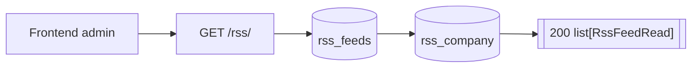
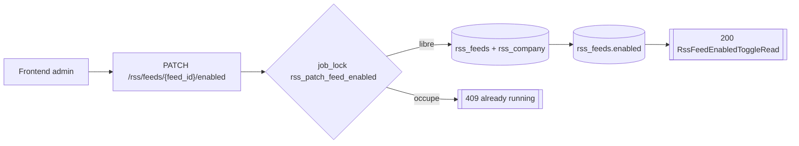
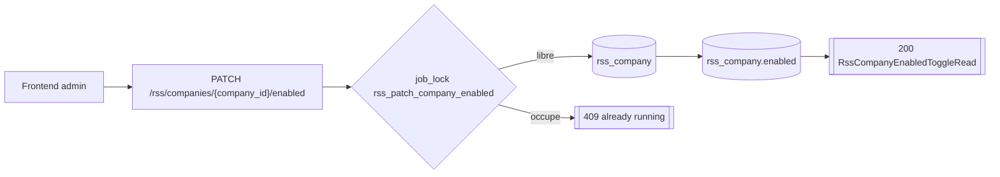
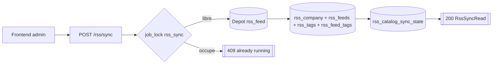
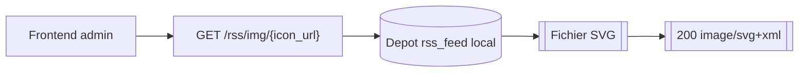

# Routes RSS

## GET /rss/

- Consommateurs : `frontend/src/services/api/rss.service.ts`.
- Securite : `Session admin`.
- Inputs : aucun.
- Output :
  - `200` `list[RssFeedRead]`.
- Tables / systemes :
  - lecture `rss_feeds` ;
  - lecture `rss_company`.
- Processus :
  1. lit tous les feeds RSS ;
  2. joint la compagnie si presente ;
  3. remonte `enabled`, `trust_score`, `fetchprotection`, infos compagnie.

## PATCH /rss/feeds/{feed_id}/enabled

- Consommateurs : `frontend/src/services/api/rss.service.ts`.
- Securite : `Session admin`.
- Inputs :
  - Path `feed_id >= 1`.
  - Body `RssEnabledTogglePayload { enabled }`.
- Output :
  - `200` `RssFeedEnabledToggleRead`.
- Erreurs :
  - `404` feed inconnu.
  - `409` si la compagnie du feed est desactivee.
  - `409` si un autre toggle du meme type tourne deja.
  - `422` validation Pydantic.
- Tables / systemes :
  - lecture `rss_feeds` join `rss_company` ;
  - mise a jour `rss_feeds.enabled`.
- Processus :
  1. prend un `job_lock("rss_patch_feed_enabled")` ;
  2. charge l'etat courant du feed ;
  3. interdit l'activation/desactivation si la compagnie est desactivee ;
  4. met a jour `rss_feeds.enabled` si necessaire ;
  5. commit.

## PATCH /rss/companies/{company_id}/enabled

- Consommateurs : `frontend/src/services/api/rss.service.ts`.
- Securite : `Session admin`.
- Inputs :
  - Path `company_id >= 1`.
  - Body `RssEnabledTogglePayload { enabled }`.
- Output :
  - `200` `RssCompanyEnabledToggleRead`.
- Erreurs :
  - `404` compagnie inconnue.
  - `409` si un autre toggle compagnie tourne deja.
- Tables / systemes :
  - lecture `rss_company` ;
  - mise a jour `rss_company.enabled`.
- Processus :
  1. prend `job_lock("rss_patch_company_enabled")` ;
  2. lit la compagnie ;
  3. met a jour `enabled` si necessaire ;
  4. commit.

## POST /rss/sync

- Consommateurs : `frontend/src/services/api/rss.service.ts`.
- Securite : `Session admin`.
- Inputs :
  - Query `force: bool = false`.
- Output :
  - `200` `RssSyncRead`.
- Erreurs :
  - `409` sync deja en cours.
  - `502` echec git ou echec d'enqueue metier.
  - `422` parsing catalogue invalide.
- Tables / systemes :
  - depot `rss_feed` local ;
  - `rss_catalog_sync_state` ;
  - `rss_company` ;
  - `rss_feeds` ;
  - `rss_tags` ;
  - `rss_feed_tags`.
- Processus :
  1. prend `job_lock("rss_sync")` ;
  2. clone/pull le depot catalogue ;
  3. compare le commit courant avec `rss_catalog_sync_state.last_applied_revision` ;
  4. si rien a faire et `force=false`, retourne `mode=noop` ;
  5. sinon charge les fichiers JSON modifies ou tout le catalogue ;
  6. upsert compagnies et feeds ;
  7. remplace les tags des feeds touches ;
  8. supprime feeds et compagnies absents du catalogue ;
  9. met a jour `rss_catalog_sync_state` ;
  10. commit.

## GET /rss/img/{icon_url}

- Consommateurs : `frontend/src/features/rss/components/FeedCard.tsx`, `frontend/src/features/rss/components/CompanyCard.tsx`.
- Securite : `Session admin`.
- Inputs :
  - Path `icon_url` au format chemin relatif vers une icone SVG du depot.
- Output :
  - `200` `image/svg+xml`.
- Erreurs :
  - `404` icone introuvable.
- Tables / systemes :
  - depot `rss_feed` local, cote filesystem.
- Processus :
  1. resolve le fichier SVG depuis le depot local ;
  2. retourne un `FileResponse`.
