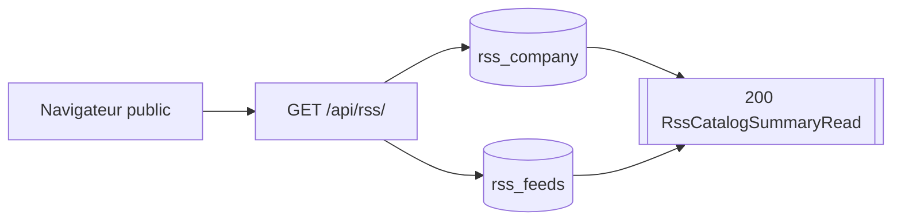
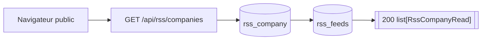
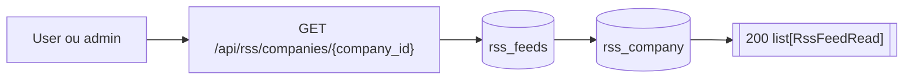
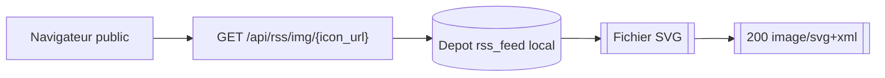

# Routes RSS

## GET /api/rss/

- Consommateurs : `frontend/src/features/rss/components/PublicRssCatalog.tsx`.
- Securite : `Public`.
- Output :
  - `200` `RssCatalogSummaryRead { companies_total, feeds_total }`.
- Processus :
  1. compte toutes les compagnies ;
  2. compte tous les feeds ;
  3. retourne uniquement le resume global.

## GET /api/rss/companies

- Consommateurs : `frontend/src/features/rss/components/PublicRssCatalog.tsx`.
- Securite : `Public`.
- Output :
  - `200` `list[RssCompanyRead]` avec `feed_count`.
- Processus :
  1. lit toutes les compagnies ;
  2. compte les feeds rattaches a chacune ;
  3. retourne la liste complete sans pagination.

## GET /api/rss/companies/{company_id}

- Consommateurs : `frontend/src/features/rss/components/PublicRssCatalog.tsx`.
- Securite : `Session user ou admin`.
- Inputs :
  - Path `company_id >= 1`.
- Output :
  - `200` `list[RssFeedRead]`.
- Erreurs :
  - `401` session absente ;
  - `404` compagnie inconnue.
- Processus :
  1. verifie la session web ;
  2. lit tous les feeds de la compagnie demandee ;
  3. retourne l’integralite des feeds de cette compagnie, sans pagination.

## GET /api/rss/img/{icon_url}

- Consommateurs : `frontend/src/features/rss/components/CompanyCard.tsx`, `frontend/src/features/rss/components/FeedCard.tsx`.
- Securite : `Public`.
- Output :
  - `200` `image/svg+xml`.
- Processus :
  1. resolve l’icone du depot local ;
  2. retourne le SVG sans pagination ni restriction fonctionnelle.

## PATCH /api/rss/feeds/{feed_id}/enabled

- Consommateurs : `frontend/src/services/api/rss.service.ts`.
- Securite : `Session admin`.
- Inputs :
  - Path `feed_id >= 1`.
  - Body `RssEnabledTogglePayload { enabled }`.
- Output :
  - `200` `RssFeedEnabledToggleRead`.

## PATCH /api/rss/companies/{company_id}/enabled

- Consommateurs : `frontend/src/services/api/rss.service.ts`.
- Securite : `Session admin`.
- Inputs :
  - Path `company_id >= 1`.
  - Body `RssEnabledTogglePayload { enabled }`.
- Output :
  - `200` `RssCompanyEnabledToggleRead`.

## POST /api/rss/sync

- Consommateurs : `frontend/src/services/api/rss.service.ts`.
- Securite : `Session admin`.
- Inputs :
  - Query `force: bool = false`.
- Output :
  - `200` `RssSyncRead`.
