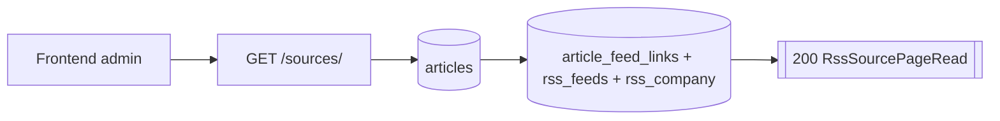
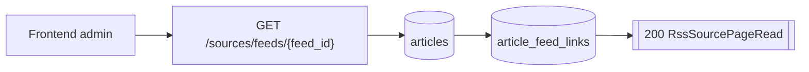
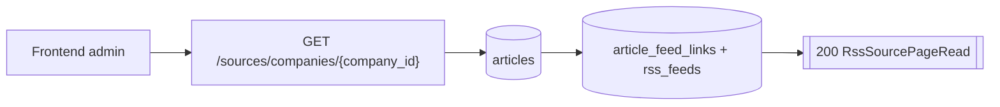
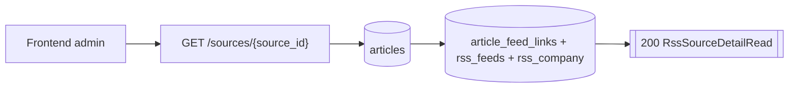
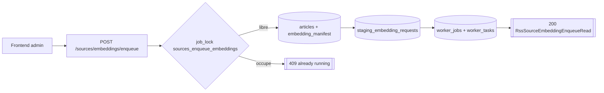

# Routes Sources

## GET /sources/

- Consommateurs : `frontend/src/services/api/sources.service.ts`.
- Securite : `Session admin`.
- Inputs :
  - Query `limit` par defaut `50`, `1..100`.
  - Query `offset` par defaut `0`.
- Output :
  - `200` `RssSourcePageRead`.
- Tables / systemes :
  - lecture `articles` ;
  - lecture `article_feed_links`, `rss_feeds`, `rss_company` pour les noms de compagnie.
- Processus :
  1. compte les articles correspondant aux filtres ;
  2. lit la page triee par `published_at desc nulls last, article_id desc` ;
  3. relit les compagnies rattachees a chaque article ;
  4. retourne `items`, `total`, `limit`, `offset`.

## GET /sources/feeds/{feed_id}

- Consommateurs : `frontend/src/services/api/sources.service.ts`.
- Securite : `Session admin`.
- Inputs :
  - Path `feed_id >= 1`.
  - Query `limit`, `offset`.
- Output :
  - `200` `RssSourcePageRead`.
- Tables / systemes :
  - lecture `articles` ;
  - filtre `EXISTS` sur `article_feed_links`.
- Processus :
  1. meme pipeline que `GET /sources/` ;
  2. ajoute un filtre `link.feed_id = :feed_id`.

## GET /sources/companies/{company_id}

- Consommateurs : `frontend/src/services/api/sources.service.ts`.
- Securite : `Session admin`.
- Inputs :
  - Path `company_id >= 1`.
  - Query `limit`, `offset`.
- Output :
  - `200` `RssSourcePageRead`.
- Tables / systemes :
  - lecture `articles` ;
  - filtre `EXISTS` sur `article_feed_links` join `rss_feeds`.
- Processus :
  1. meme pipeline que `GET /sources/` ;
  2. ajoute un filtre `feed.company_id = :company_id`.

## GET /sources/{source_id}

- Consommateurs : `frontend/src/services/api/sources.service.ts`.
- Securite : `Session admin`.
- Inputs :
  - Path `source_id >= 1`.
- Output :
  - `200` `RssSourceDetailRead`.
- Erreurs :
  - `404` source inconnue.
- Tables / systemes :
  - lecture `articles` ;
  - lecture `article_feed_links`, `rss_feeds`, `rss_company`.
- Processus :
  1. lit l'article canonique ;
  2. relit toutes les liaisons feed de cet article ;
  3. agrege `company_names` et `feed_sections` uniques ;
  4. retourne le detail.

## POST /sources/embeddings/enqueue

- Consommateurs : `frontend/src/services/api/sources.service.ts`.
- Securite : `Session admin`.
- Inputs :
  - Query `reembed_model_mismatches: bool = false`.
- Output :
  - `200` `RssSourceEmbeddingEnqueueRead`.
- Erreurs :
  - `409` si un job embedding actif existe deja pour la `worker_version` cible.
  - `409` si une autre creation du meme type tourne deja.
- Tables / systemes :
  - lecture `articles` ;
  - lecture `embedding_manifest` ;
  - ecriture `staging_embedding_requests` ;
  - ecriture `worker_jobs` ;
  - ecriture `worker_tasks`.
- Processus :
  1. prend `job_lock("sources_enqueue_embeddings")` ;
  2. resolve `worker_version` cible ;
  3. refuse s'il existe deja un job `source_embedding` actif pour cette version ;
  4. lit les articles sans `embedding_manifest.status='indexed'` pour cette version ;
  5. cree un `worker_jobs` ;
  6. cree `staging_embedding_requests` ;
  7. batch les sources par 128 ;
  8. cree les `worker_tasks` `embed.source` ;
  9. commit ;
  10. si aucun candidat, retourne `job_id=null` et `status=completed`.
- Note contractuelle :
  - le flag `reembed_model_mismatches` est expose mais n'est pas encore exploite dans la selection SQL courante.
