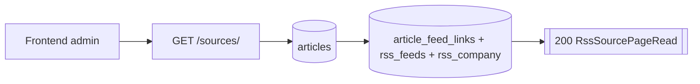
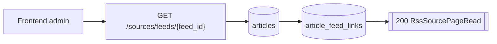
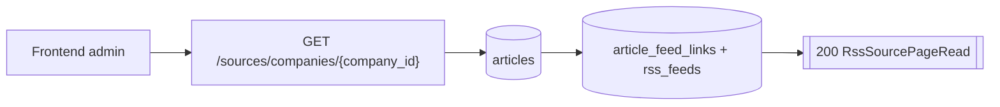
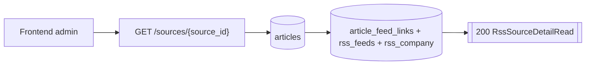

# Routes Sources

## GET /sources/

- Consommateurs : `frontend/src/services/api/sources.service.ts`.
- Securite : `Session admin`.
- Inputs :
  - Query `limit` par defaut `50`, `1..100`.
  - Query `offset` par defaut `0`.
  - Query optionnelle `author_id >= 1`.
- Output :
  - `200` `RssSourcePageRead`.
- Tables / systemes :
  - lecture `articles` ;
  - lecture `authors`, `article_authors` pour les auteurs ;
  - lecture `article_feed_links`, `rss_feeds`, `rss_company` pour les noms de compagnie.
- Processus :
  1. compte les articles correspondant aux filtres ;
  2. lit la page triee par `published_at desc nulls last, article_id desc` ;
  3. relit les compagnies rattachees a chaque article ;
  4. agrege les auteurs ordonnes pour chaque article ;
  5. retourne `items`, `total`, `limit`, `offset`.

## GET /sources/feeds/{feed_id}

- Consommateurs : `frontend/src/services/api/sources.service.ts`.
- Securite : `Session admin`.
- Inputs :
  - Path `feed_id >= 1`.
  - Query `limit`, `offset`, `author_id?`.
- Output :
  - `200` `RssSourcePageRead`.
- Tables / systemes :
  - lecture `articles` ;
  - filtre `EXISTS` sur `article_feed_links`.
- Processus :
  1. meme pipeline que `GET /sources/` ;
  2. ajoute un filtre `link.feed_id = :feed_id`.

## GET /sources/companies/{company_id}

- Consommateurs : `frontend/src/services/api/sources.service.ts`.
- Securite : `Session admin`.
- Inputs :
  - Path `company_id >= 1`.
  - Query `limit`, `offset`, `author_id?`.
- Output :
  - `200` `RssSourcePageRead`.
- Tables / systemes :
  - lecture `articles` ;
  - filtre `EXISTS` sur `article_feed_links` join `rss_feeds`.
- Processus :
  1. meme pipeline que `GET /sources/` ;
  2. ajoute un filtre `feed.company_id = :company_id`.

## GET /sources/{source_id}

- Consommateurs : `frontend/src/services/api/sources.service.ts`.
- Securite : `Session admin`.
- Inputs :
  - Path `source_id >= 1`.
- Output :
  - `200` `RssSourceDetailRead`.
- Erreurs :
  - `404` source inconnue.
- Tables / systemes :
  - lecture `articles` ;
  - lecture `authors`, `article_authors`, `article_feed_links`, `rss_feeds`, `rss_company`.
- Processus :
  1. lit l'article canonique ;
  2. relit toutes les liaisons feed de cet article ;
  3. agrege les auteurs ordonnes de l'article ;
  4. agrege `company_names` et `feed_sections` uniques ;
  5. retourne le detail.
