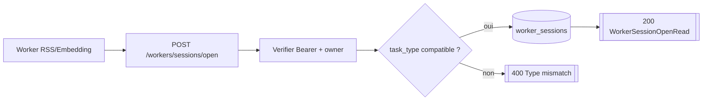
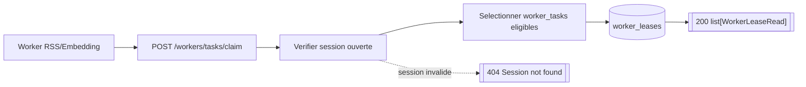
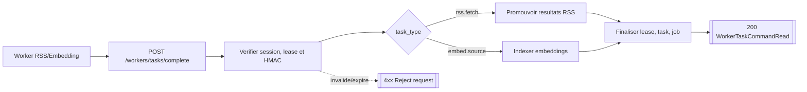
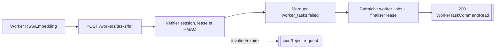
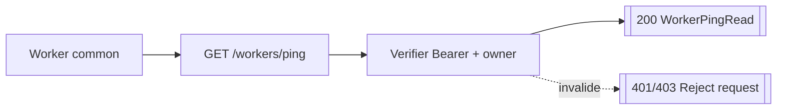
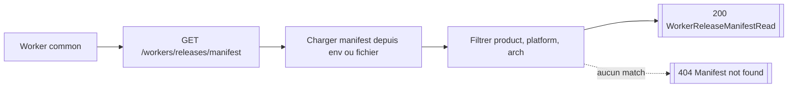

# Routes Workers

## POST /workers/sessions/open

- Consommateurs :
  - `workers/worker-rss/src/api.rs`
  - `workers/worker-source-embedding/src/api.rs`
- Securite : `Worker bearer`.
- Inputs :
  - Body `WorkerSessionOpenRequestSchema` :
    - `task_type`
    - `worker_version?`
    - `session_ttl_seconds`
- Output :
  - `200` `WorkerSessionOpenRead`.
- Erreurs :
  - `401` Bearer manquant ou cle invalide.
  - `403` owner inactif ou acces API desactive.
  - `400` `task_type` non supporte.
  - `400` si le `worker_type` de la cle ne correspond pas au `task_type`.
- Tables / systemes :
  - lecture `user_api_keys`, `users` ;
  - ecriture `worker_sessions`.

## POST /workers/tasks/claim

- Consommateurs :
  - `workers/worker-rss/src/api.rs`
  - `workers/worker-source-embedding/src/api.rs`
- Securite : `Worker bearer`.
- Inputs :
  - Body `WorkerTaskClaimRequestSchema` :
    - `session_id`
    - `task_type`
    - `worker_version?`
    - `count`
    - `lease_seconds`
- Output :
  - `200` `list[WorkerLeaseRead]`.
- Erreurs :
  - `404` session absente.
  - `400` mismatch protocolaire (`task_type`, `worker_version`, payload_ref).
- Tables / systemes :
  - lecture / mise a jour `worker_tasks` avec `FOR UPDATE SKIP LOCKED` ;
  - ecriture `worker_leases`.

## POST /workers/tasks/complete

- Consommateurs :
  - `workers/worker-rss/src/api.rs`
  - `workers/worker-source-embedding/src/api.rs`
- Securite : `Worker bearer + HMAC`.
- Inputs :
  - Body commun `WorkerTaskCompleteRequestSchema` :
    - `session_id`
    - `lease_id`
    - `trace_id`
    - `task_type`
    - `worker_version?`
    - `signed_at`
    - `nonce`
    - `signature`
    - `result_payload`
  - `result_payload` RSS :
    - `contract_version="rss-worker-result"`
    - `result_events[]`
    - `local_dedup`
  - `result_payload` embedding :
    - `sources[]` avec `id`, `embedding[]`.
- Output :
  - `200` `WorkerTaskCommandRead { ok: true }`.
- Erreurs :
  - `403` signature HMAC invalide.
  - `404` session ou lease absente.
  - `409` lease deja finalisee ou expiree.
  - `400` payload incompatible avec le contrat attendu.
- Tables / systemes :
  - toujours : `worker_leases`, `worker_tasks`, `worker_jobs`.
  - branche RSS :
    - `staging_feed_fetch_results` ;
    - `staging_article_candidates` ;
    - `articles` ;
    - `article_feed_links` ;
    - `article_versions` ;
    - `rss_feed_runtime` ;
    - `ingest_events` ;
    - `dedup_decisions`.
  - branche embedding :
    - `embedding_manifest` ;
    - Qdrant.
- Notes importantes :
  - pour les embeddings, le backend reparse le body brut JSON pour conserver une
    canonicalisation numerique compatible signature ;
  - pour RSS, le backend exige un resultat pour chaque `feed_id` present dans le payload
    de task.

## POST /workers/tasks/fail

- Consommateurs :
  - `workers/worker-rss/src/api.rs`
  - `workers/worker-source-embedding/src/api.rs`
- Securite : `Worker bearer + HMAC`.
- Inputs :
  - Body `WorkerTaskFailRequestSchema` :
    - `session_id`
    - `lease_id`
    - `trace_id`
    - `task_type`
    - `worker_version?`
    - `signed_at`
    - `nonce`
    - `signature`
    - `error_message`
- Output :
  - `200` `WorkerTaskCommandRead { ok: true }`.
- Erreurs :
  - `403` signature invalide.
  - `404` session ou lease absente.
  - `409` lease deja finalisee ou expiree.
- Tables / systemes :
  - mise a jour `worker_tasks` ;
  - refresh `worker_jobs` ;
  - finalisation `worker_leases`.

## GET /workers/ping

- Consommateurs :
  - `workers/manifeed-worker-common/src/diagnostics.rs`
- Securite : `Worker bearer`.
- Inputs : pas de body.
- Output :
  - `200` `WorkerPingRead { ok, worker_type, worker_name }`.
- Erreurs :
  - `401` Bearer manquant/invalide.
  - `403` owner inactif ou acces API coupe.

## GET /workers/releases/manifest

- Consommateurs :
  - `workers/manifeed-worker-common/src/release.rs`
- Securite : `Public`.
- Inputs :
  - Query `product`
  - Query `platform`
  - Query `arch`
- Output :
  - `200` `WorkerReleaseManifestRead`.
- Erreurs :
  - `404` aucun manifest configure pour la combinaison demandee.
- Tables / systemes :
  - aucun acces DB ;
  - lecture configuration via `WORKER_RELEASE_MANIFEST_JSON` ou `WORKER_RELEASE_MANIFEST_PATH`.
