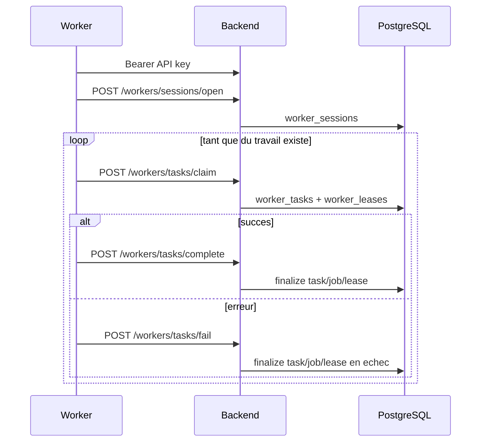

# Workers Rust

## Role

Les binaires Rust n'accedent ni directement a PostgreSQL, ni a Qdrant.
Ils parlent exclusivement au backend via le gateway HTTP `/workers/*`.

## Endpoints consommes actuellement

### Worker RSS

- `GET /workers/ping`
- `POST /workers/sessions/open`
- `POST /workers/tasks/claim`
- `POST /workers/tasks/complete`
- `POST /workers/tasks/fail`
- `GET /workers/releases/manifest`

### Worker embedding

- `GET /workers/ping`
- `POST /workers/sessions/open`
- `POST /workers/tasks/claim`
- `POST /workers/tasks/complete`
- `POST /workers/tasks/fail`
- `GET /workers/releases/manifest`

## Protocole commun

## Authentification et integrite

- l'API key worker provient de `POST /account/api-keys` ;
- la cle brute n'est renvoyee qu'une seule fois a la creation ;
- le backend stocke uniquement `user_api_keys.key_hash` ;
- `complete` et `fail` exigent une signature HMAC du body ;
- le backend verifie aussi la coherence `task_type`, `worker_version`, `lease_id`, `trace_id`.

## Ce que fait le backend apres reception

### Quand le worker RSS complete

Le backend :

- valide le contrat `WorkerRssTaskResultPayloadSchema` ;
- persiste les traces de fetch dans `staging_feed_fetch_results` ;
- persiste les candidats dans `staging_article_candidates` ;
- promeut les articles dans `articles`, `article_feed_links`, `article_versions` ;
- met a jour `rss_feed_runtime` ;
- journalise `ingest_events` et `dedup_decisions` ;
- met a jour `worker_tasks`, `worker_jobs`, `worker_leases`, `worker_sessions`.

### Quand le worker embedding complete

Le backend :

- valide les dimensions et la norme du vecteur ;
- pousse le vecteur dans Qdrant ;
- met a jour `embedding_manifest` ;
- met a jour `worker_tasks`, `worker_jobs`, `worker_leases`, `worker_sessions`.

## Releases

Le backend peut servir un manifest de release via `GET /workers/releases/manifest`.
Le crate partage `manifeed-worker-common` l'utilise pour verifier la compatibilite
de version et la disponibilite d'une mise a jour.
