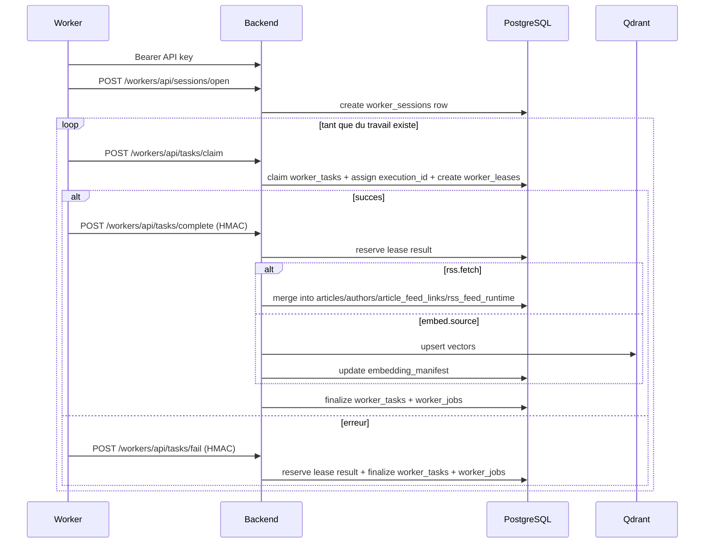

# Workers Rust

## Role

Les binaires Rust n'accedent ni directement a PostgreSQL ni a Qdrant.
Ils parlent exclusivement au backend via le gateway HTTP `/workers/api/*`.

Le transport HTTP worker est maintenant centralise dans `manifeed-worker-common::WorkerGatewayClient`.
Les crates metier RSS et Embedding ne gardent que :

- le parsing du payload de task
- l'execution locale
- la construction du `result_payload`

## Endpoints consommes

### Par le crate partage

- `GET /workers/api/ping`
- `POST /workers/api/sessions/open`
- `POST /workers/api/tasks/claim`
- `POST /workers/api/tasks/complete`
- `POST /workers/api/tasks/fail`
- `GET /workers/api/releases/manifest`

### Par worker metier

- `worker-rss` consomme le crate partage avec `task_type = rss.fetch`
- `worker-source-embedding` consomme le crate partage avec `task_type = embed.source`

## Protocole runtime

## Authentification et integrite

- l'API key worker provient de `POST /api/account/api-keys`
- la cle brute n'est renvoyee qu'une seule fois a la creation
- le backend stocke uniquement `user_api_keys.key_hash`
- `complete` et `fail` exigent une signature HMAC du body
- le backend verifie la coherence `task_type`, `worker_version`, `lease_id`, `trace_id`
- chaque claim attribue un `execution_id` distinct du `task_id`
- `complete` et `fail` sont idempotents pour un retry identique sur une lease deja finalisee

## Telemetrie locale

Les workers exposent un `status.json` local partage avec l'application desktop.
Le snapshot conserve uniquement les champs utiles au pilotage :

- `phase`
- `server_connection`
- `current_task`
- `completed_task_count`
- `last_error`
- des compteurs reseau agregees

Les ecritures disque sont maintenant coalescentes :

- mise a jour memoire immediate
- flush force sur transitions majeures (`starting`, `processing`, `idle`, `error`, `stopped`, connectivite)
- pas d'ecriture a chaque micro-evenement reseau

## Effets backend par type de worker

### Quand le worker RSS complete

Le backend :

- valide `WorkerRssTaskResultPayloadSchema`
- verifie que tous les `feed_id` attendus sont presents une seule fois
- fusionne directement les resultats dans `articles`
- maintient `authors`, `article_authors`, `article_feed_links`
- met a jour `rss_feed_runtime`
- finalise `worker_tasks`, `worker_jobs` et `worker_leases`

### Quand le worker Embedding complete

Le backend :

- valide le payload et les `article_id` attendus
- valide dimensions, finitude et norme des vecteurs
- pousse les vecteurs dans Qdrant
- met a jour `embedding_manifest`
- finalise `worker_tasks`, `worker_jobs` et `worker_leases`

## Releases

Le backend expose un catalogue de releases desktop / RSS / embedding.
Le crate partage `manifeed-worker-common` utilise `GET /workers/api/releases/manifest`
pour resoudre l'artefact compatible avec le host courant et verifier la compatibilite
de version.

Points cle :

- le desktop se met a jour contre la famille `desktop` uniquement
- RSS et Embedding se mettent a jour independamment avec leurs propres bundles
- `embedding` garde un `worker_version` metier distinct du `package.version`
- le telechargement desktop est public
- les bundles RSS / Embedding sont telecharges via `GET /workers/api/releases/download/{artifact_name}` avec Bearer worker
