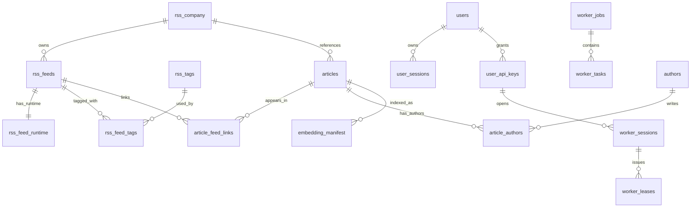

# Relations entre tables

## Diagramme ER



## Vue ASCII

```text
rss_company (1) ---- (0..n) rss_feeds
rss_feeds   (1) ---- (0..1) rss_feed_runtime
rss_feeds   (1) ---- (0..n) rss_feed_tags (n..0) ---- (1) rss_tags
rss_company (1) ---- (0..n) articles
rss_feeds   (1) ---- (0..n) article_feed_links (n..0) ---- (1) articles
articles    (1) ---- (0..n) article_authors (n..0) ---- (1) authors

users           (1) ---- (0..n) user_sessions
users           (1) ---- (0..n) user_api_keys
user_api_keys   (1) ---- (0..n) worker_sessions
worker_sessions (1) ---- (0..n) worker_leases
worker_jobs     (1) ---- (0..n) worker_tasks
articles        (1) ---- (0..n) embedding_manifest
```

## Notes

- `worker_leases` n'a pas de cle etrangere directe vers `worker_tasks` :
  la liaison est logique via `payload_ref` et le `execution_id` actif.
- `worker_jobs` et `worker_tasks` remplacent les anciennes familles techniques RSS et embedding.
- `articles`, `article_authors` et `article_feed_links` constituent le stockage canonique des resultats RSS.
- `embedding_manifest` est la source relationnelle de reference pour l'etat des embeddings, tandis que Qdrant stocke les vecteurs.
