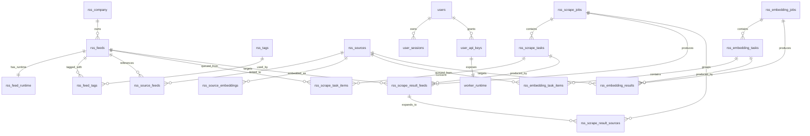

# Relations entre tables

## Diagramme ER



## Vue ASCII

```text
rss_company (1) ---- (0..n) rss_feeds
rss_feeds   (1) ---- (0..1) rss_feed_runtime
rss_feeds   (1) ---- (0..n) rss_feed_tags (n..0) ---- (1) rss_tags

rss_feeds   (1) ---- (0..n) rss_source_feeds (n..0) ---- (1) rss_sources
rss_sources (1) ---- (0..n) rss_source_embeddings

users        (1) ---- (0..n) user_sessions
users        (1) ---- (0..n) user_api_keys
user_api_keys (1) --- (0..1) worker_runtime

rss_scrape_jobs (1) ---- (0..n) rss_scrape_tasks
rss_scrape_tasks (1) ---- (0..n) rss_scrape_task_items (n..0) ---- (1) rss_feeds
rss_scrape_jobs (1) ---- (0..n) rss_scrape_result_feeds
rss_scrape_result_feeds (1) ---- (0..n) rss_scrape_result_sources

rss_embedding_jobs (1) ---- (0..n) rss_embedding_tasks
rss_embedding_tasks (1) ---- (0..n) rss_embedding_task_items (n..0) ---- (1) rss_sources
rss_embedding_jobs (1) ---- (0..n) rss_embedding_results
rss_embedding_results (n..0) ---- (1) rss_sources
```

## Notes importantes

- `rss_source_embeddings` et `rss_embedding_results` sont relies logiquement par `worker_version`, pas par un `embedding_model_id`.
- `user_api_keys` est la vraie source d'identite des workers ; `worker_runtime` n'est qu'un etat courant.
- le nom de worker expose par le backend est derive de `users.pseudo + worker_type + worker_number`.
- `rss_scrape_result_*` et `rss_embedding_results` restent des tables techniques de transit avant finalisation.
