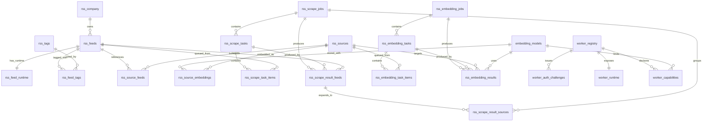

# Relations entre tables

## Diagramme ER



## Vue ASCII

```text
rss_company (1) ---- (0..n) rss_feeds
rss_feeds   (1) ---- (0..1) rss_feed_runtime
rss_feeds   (1) ---- (0..n) rss_feed_tags (n..0) ---- (1) rss_tags

rss_feeds   (1) ---- (0..n) rss_source_feeds (n..0) ---- (1) rss_sources
rss_sources (1) ---- (0..n) rss_source_embeddings (n..0) ---- (1) embedding_models

rss_scrape_jobs (1) ---- (0..n) rss_scrape_tasks
rss_scrape_tasks (1) ---- (0..n) rss_scrape_task_items (n..0) ---- (1) rss_feeds
rss_scrape_jobs (1) ---- (0..n) rss_scrape_result_feeds
rss_scrape_result_feeds (1) ---- (0..n) rss_scrape_result_sources

rss_embedding_jobs (1) ---- (0..n) rss_embedding_tasks
rss_embedding_tasks (1) ---- (0..n) rss_embedding_task_items (n..0) ---- (1) rss_sources
rss_embedding_jobs (1) ---- (0..n) rss_embedding_results (n..0) ---- (1) embedding_models

worker_registry (1) ---- (0..n) worker_auth_challenges
worker_registry (1) ---- (0..1) worker_runtime
worker_registry (1) ---- (0..n) worker_capabilities (n..0) ---- (0..1) embedding_models
```

## Notes importantes

- `rss_source_feeds` est la liaison entre une source canonique et tous les feeds qui l'ont exposee.
- `rss_scrape_result_*` et `rss_embedding_results` sont des tables techniques de transit. Les finalizers
  les fusionnent ensuite dans `rss_sources`, `rss_source_embeddings` et `rss_feed_runtime`.
- `worker_runtime` ne reference pas formellement une table d'executions ; il stocke l'etat courant d'une
  machine vue par le backend.
- `rss_catalog_sync_state` est volontairement isolee : elle ne reference aucune autre table et sert
  uniquement a memoriser l'etat de sync du depot RSS.
