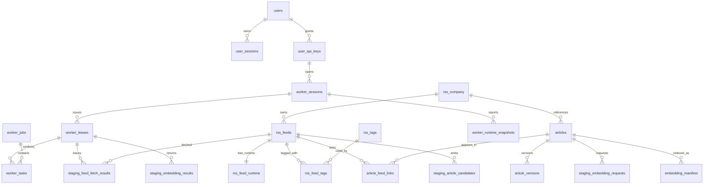

# Relations entre tables

## Diagramme ER



## Vue ASCII

```text
rss_company (1) ---- (0..n) rss_feeds
rss_feeds   (1) ---- (0..1) rss_feed_runtime
rss_feeds   (1) ---- (0..n) rss_feed_tags (n..0) ---- (1) rss_tags
rss_company (1) ---- (0..n) articles
rss_feeds   (1) ---- (0..n) article_feed_links (n..0) ---- (1) articles
articles    (1) ---- (0..n) article_versions

users         (1) ---- (0..n) user_sessions
users         (1) ---- (0..n) user_api_keys
user_api_keys (1) ---- (0..n) worker_sessions
worker_sessions (1) -- (0..n) worker_leases
worker_sessions (1) -- (0..n) worker_runtime_snapshots
worker_jobs   (1) ---- (0..n) worker_tasks
worker_leases (1) ---- (0..n) worker_tasks

worker_leases (1) ---- (0..n) staging_feed_fetch_results (n..0) ---- (1) rss_feeds
rss_feeds     (1) ---- (0..n) staging_article_candidates
articles      (1) ---- (0..n) staging_embedding_requests
worker_leases (1) ---- (0..n) staging_embedding_results
articles      (1) ---- (0..n) embedding_manifest
```

## Notes

- `worker_jobs` et `worker_tasks` remplacent les anciennes familles techniques RSS et embedding.
- `articles` et `article_feed_links` remplacent les anciennes tables `rss_sources` et `rss_source_feeds`.
- `worker_sessions` + `worker_runtime_snapshots` remplacent l'ancien stockage runtime unique.
- `embedding_manifest` est la source relationnelle de reference pour l'etat des embeddings, tandis que Qdrant stocke les vecteurs.
